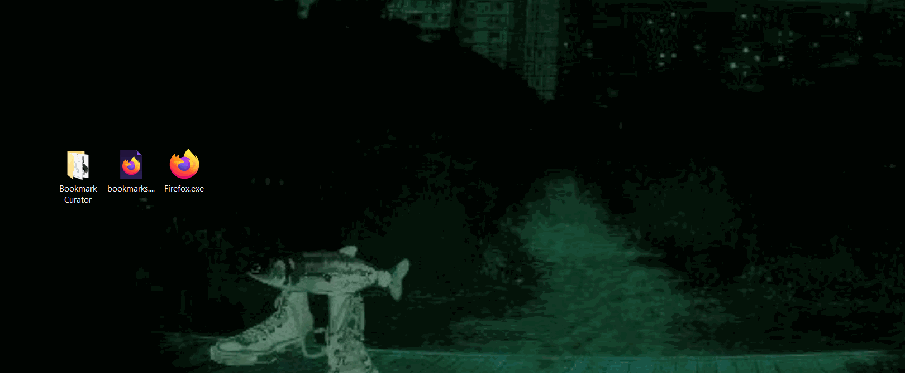
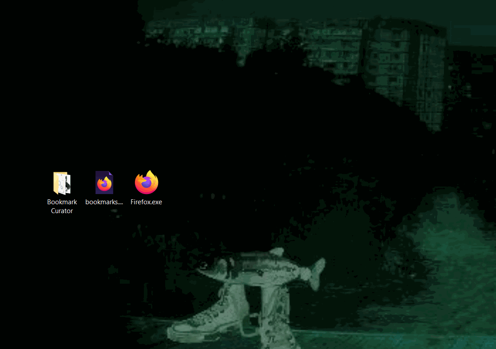
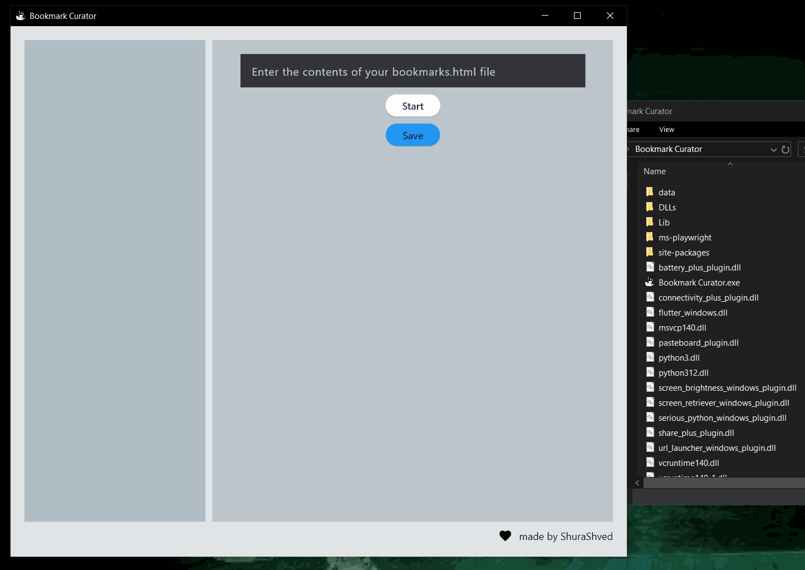
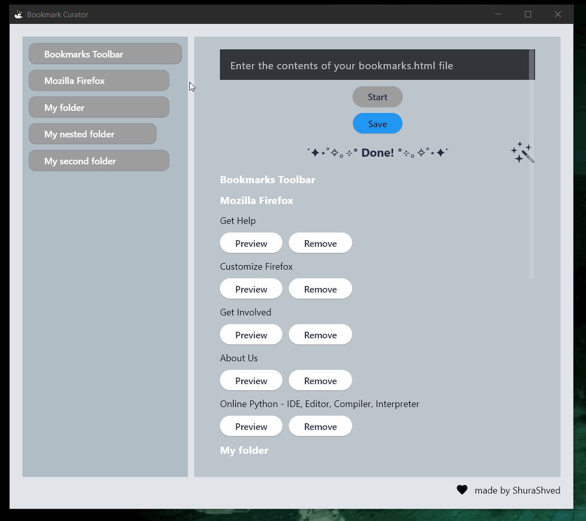
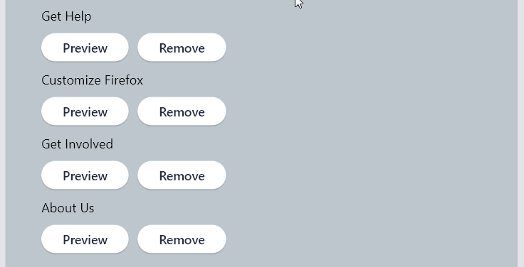
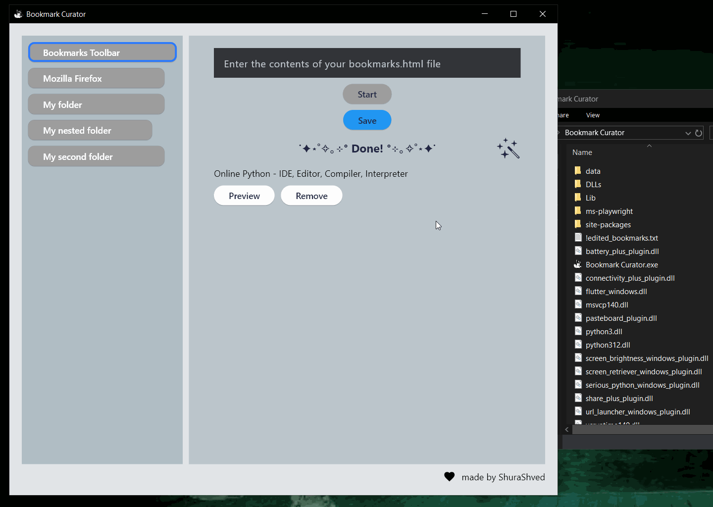
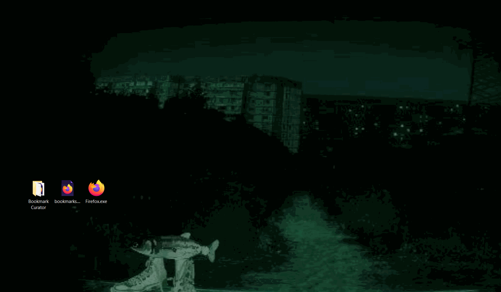
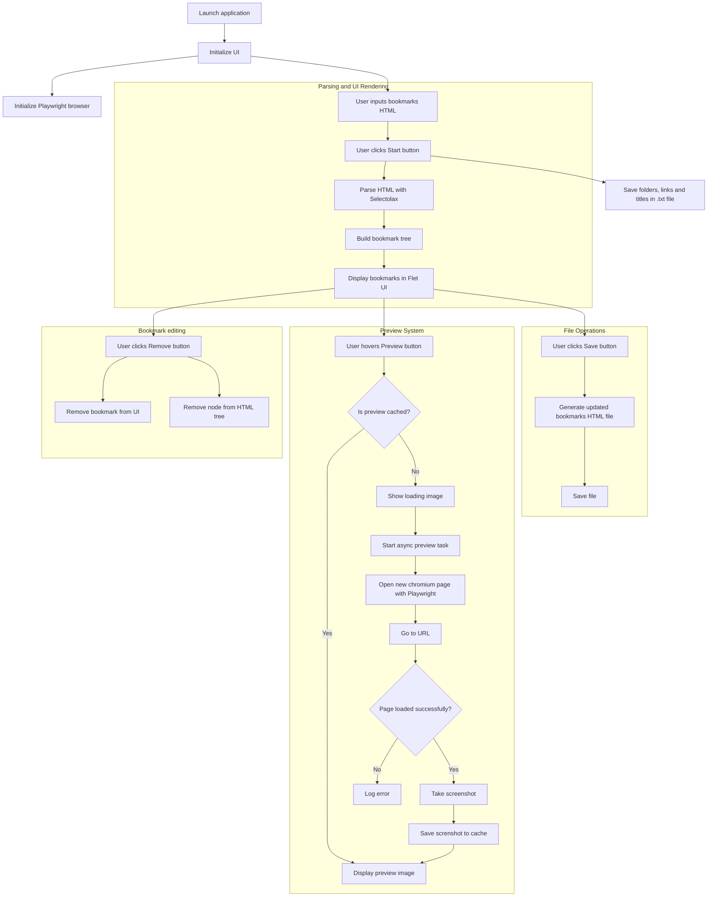

# Bookmarks Curator

This app helps users organize and review their bookmarks without opening them in browser.
For example, when you have 1000+ bookmarks and need to decide whether to keep or remove them, the only default option is to open them in a browser.
Opening them one by one is inefficient, and the "Open All Bookmarks" option tries load everything at once.
To solve this problem and provide a smoother expirience this app allows you to import bookmarks, preview them one-by-one, remove unnecessary ones, and export the edited list back to your browser.

## Technologies Used
- Python 3.10
- Flet 0.84.0
- Playwright 1.58
- Selectolax 0.4.7

## Run the App
Double-click the executable file to launch the app.

<p align="center">
  
</p>


## Copy Bookmarks
Export your bookmarks from browser in HTML format. Open the file with notepad (or any preferred text editor) and copy its contents.

<p align="center">
  
</p>

> [!TIP]
> You can also select a specific folder or individual bookmarks.
> - Folders start with the `<DT>` tag followed by `<DL>`
> - Individual bookmarks are `<DT>` elements inside a `<DL>` tag

## Start the App
Paste the copied bookmarks into the input field and click the **Start** button. 
Bookmarks and folders will appear in the app window. A text file containing the parsed bookmarks will be created as `!edited_bookmarks.txt`.

<p align="center">
  
</p>

## Preview Bookmarks
Hover over the **Preview** button to see a screenshot of the page. 
A new folder `previews` will be created to store cached screenshots.

<p align="center">
  
</p>

## Review Folders
Click a folder on the left to see its bookmarks.
Subfolders are progressively shortened to visually indicate their nesting depth.

<p align="center">
  
</p>

## Delete Bookmarks
Click the **Remove** button, to delete unwanted bookmark from the list. 

<p align="center">
  
</p>

## Export Edited Bookmarks
Once you finish editing, click the **Save** button. 
A new file named `!edited_bookmarks.html` will be created. 

<p align="center">
  
</p>

## Import Bookmarks Back to Browser
You can import the edited bookmarks back into your browser by selecting the generated file. 
If you don't know how to create the file, refer to the [previous step](#export-edited-bookmarks).

<p align="center">
  
</p>

## Application Directories
* **App Data:** `\AppData\Roaming\AXXXAXDXX\BookmarkCurator`
* **Previews:** `\AppData\Roaming\Bookmark Curator\previews`
* **Logs:** `\AppData\Local\AXXXAXDXX\BookmarkCurator`

## Application Workflow



## Build the App

Open Bookmark Curator folder in cmd, activate .venv, execute following command:  
```bash
flet build windows -v
```
When done, put ms-playwright folder on the same level as app's .exe file.

For more details on building Windows package, refer to the [Windows Packaging Guide](https://docs.flet.dev/publish/windows/).

## Hall of Shame

<a href="https://www.star-history.com/?repos=Bookmark-Curator%2FBookmark-Curator&type=date&legend=top-left">
 <picture>
   <source media="(prefers-color-scheme: dark)" srcset="https://api.star-history.com/chart?repos=Bookmark-Curator/Bookmark-Curator&type=date&theme=dark&legend=top-left" />
   <source media="(prefers-color-scheme: light)" srcset="https://api.star-history.com/chart?repos=Bookmark-Curator/Bookmark-Curator&type=date&legend=top-left" />
   
 </picture>
</a>

